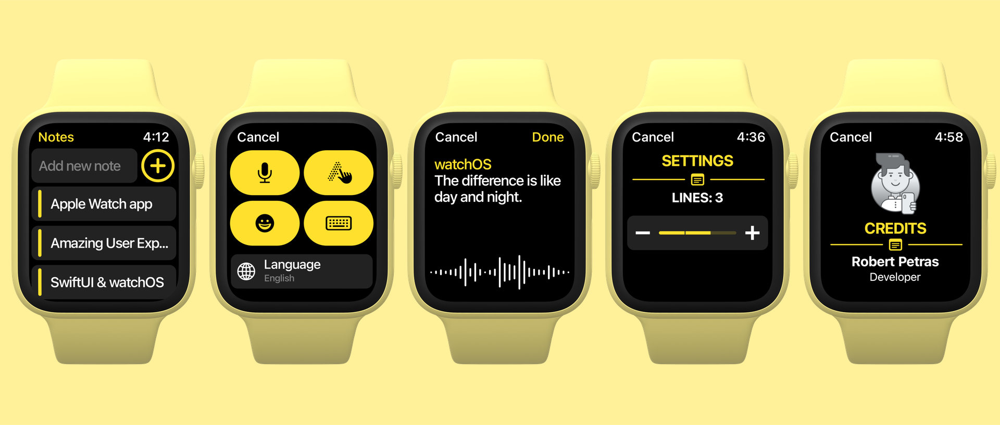
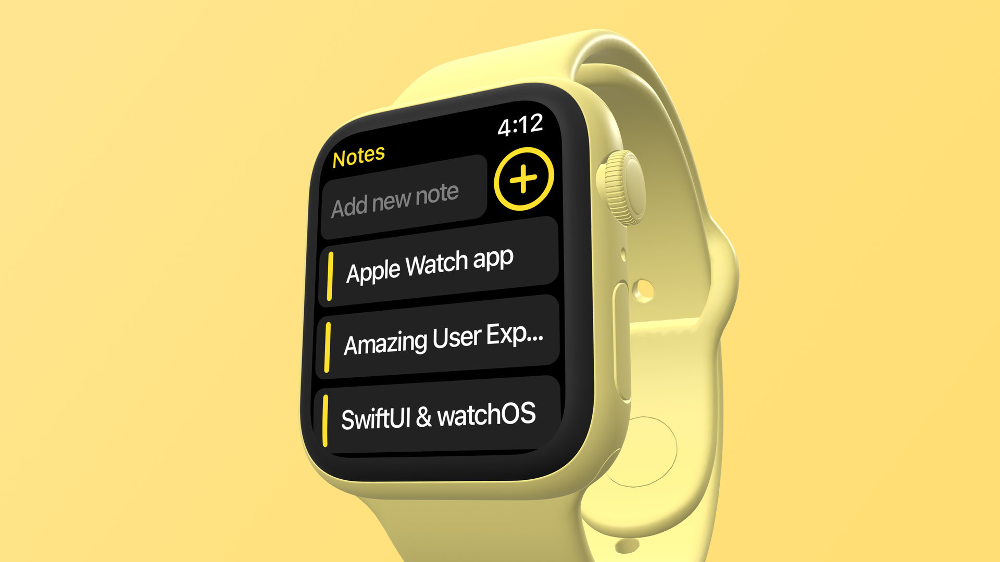
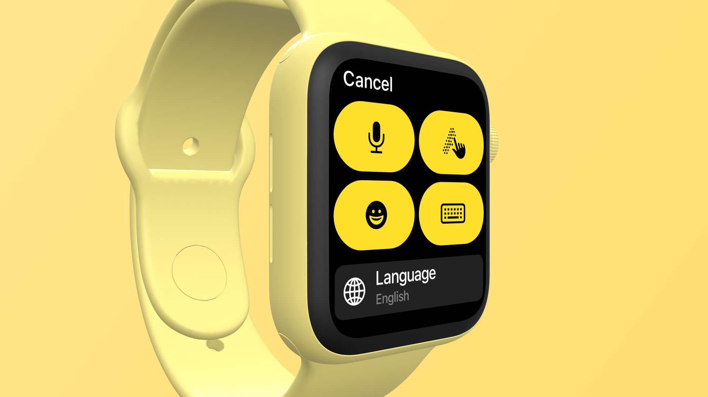
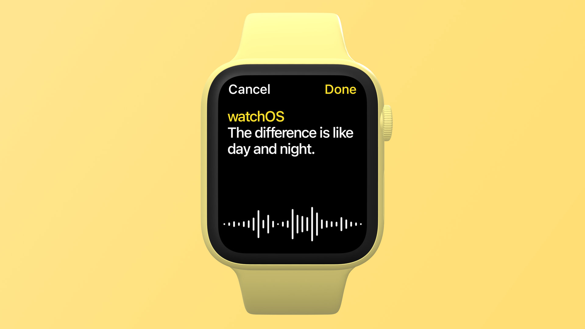
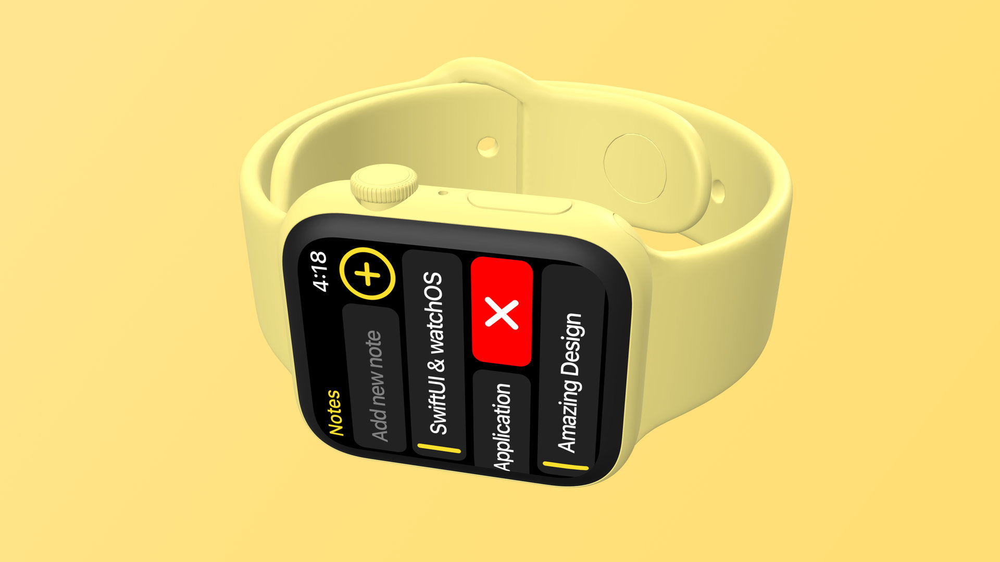
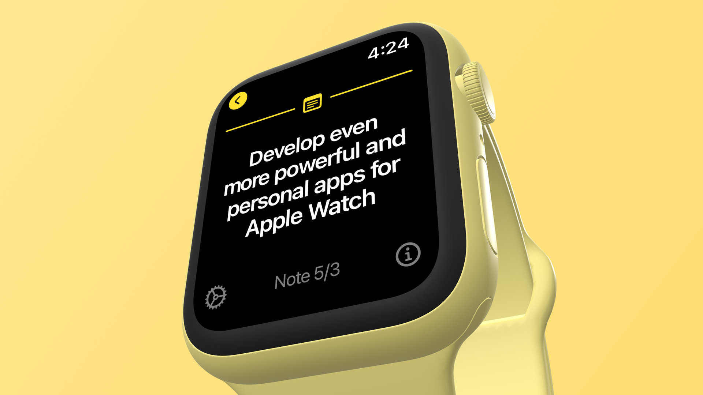
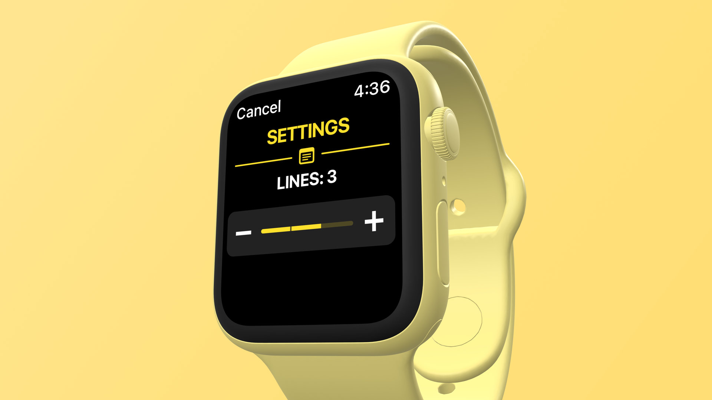
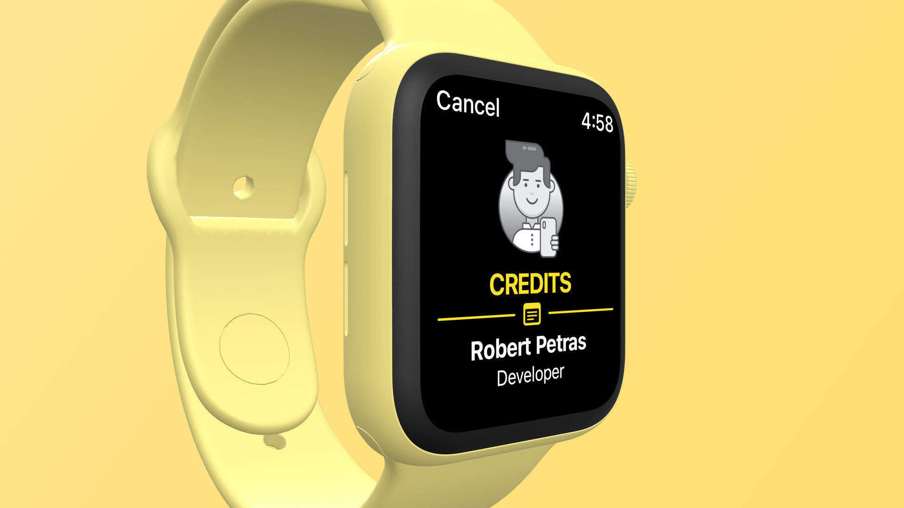
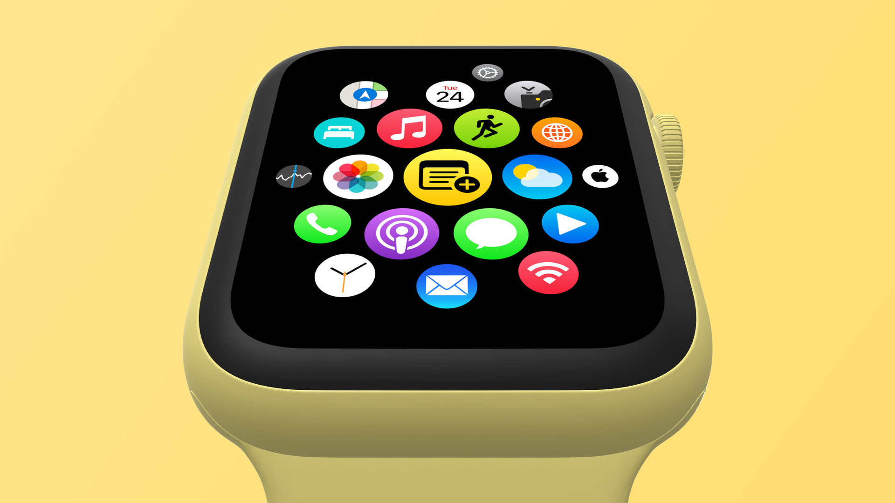

# SwiftUI 2 - watchOS - Notes
 

  

  In this SwiftUI tutorial, we are going to develop a modern Notes application for Apple watches. By creating this app, we will learn how to develop a standalone watch extension using the watchOS and SwiftUI frameworks together.

## Topics are covered:

- [x] How to get familiar with the basics of the watchOS framework
- [x] How to create multiple views and navigate between these views
- [x] How to develop a standalone Apple Watch application with SwiftUI
- [x] How to permanently save notes and store data on Apple Watch
- [x] How to show a list of notes on Apple Watch
- [x] How to select and delete notes from Apple Watch
- [x] How to show SwiftUI views conditionally
- [x] How to create and utilize uniform design language across pages
- [x] How to use Swift's Codable protocol for serialization
- [x] How to test a Watch app fullscreen in Simulator or on a device
- [x] How to develop a new feature using SwiftUI's Slider element
- [x] How to create custom user interface elements
- [x] How to add icons and asset files to a Watch extension
- [x] How to use the input tools: Dictate, Scribble, Emoji, Type

## Demo

  
  

    List of notes
  

  
  

    Input interface
  

  
  

    Dictate function
  

  
  

    Deleting a note from the list with SwiftUI's gesture
  

  
  

    Detail page
  

  
  

    Settings - line adjustment
  

  
  

    Credits page
  

  
  

    App icon
  

## Meta

Tin Tran – [Linkedin](https://www.linkedin.com/in/realtrantrungtin) – realtrantrungtin@gmail.com
